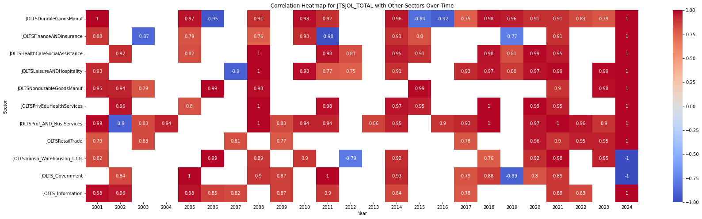
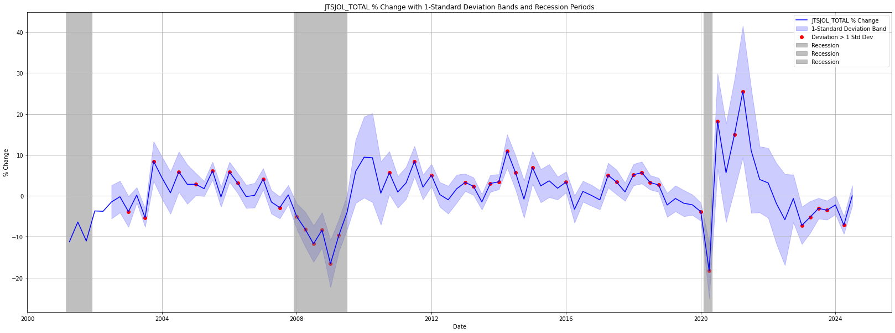
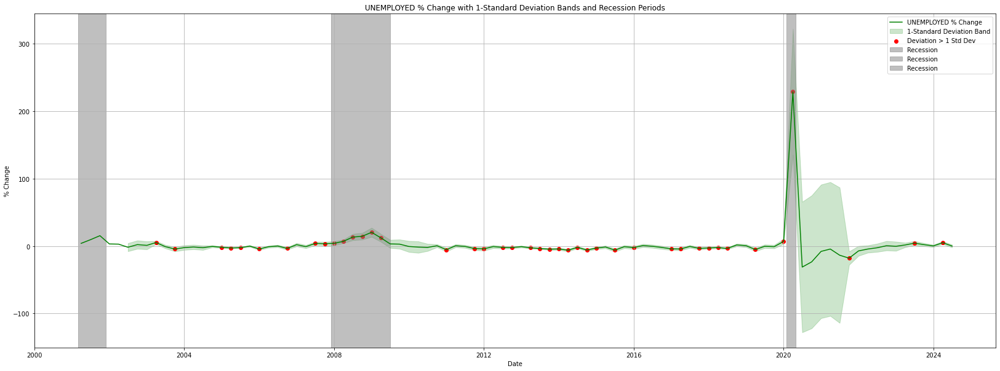
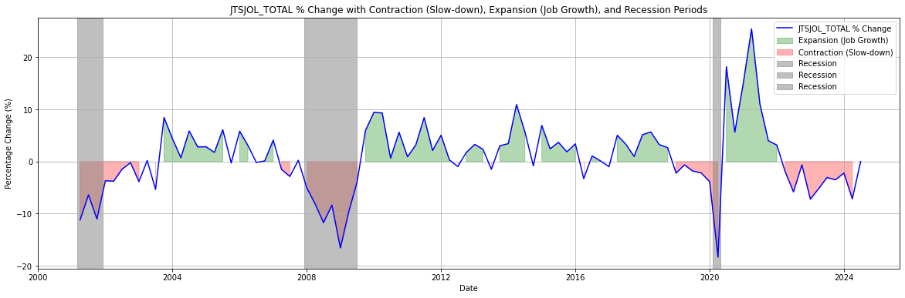
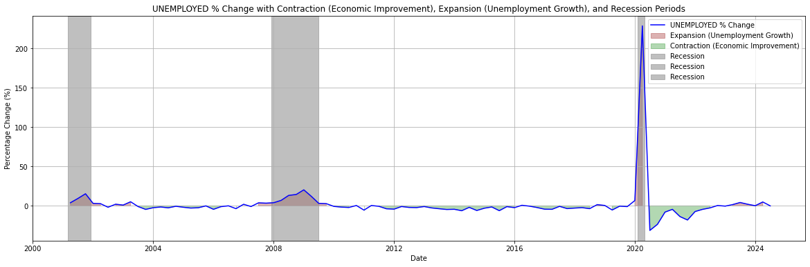
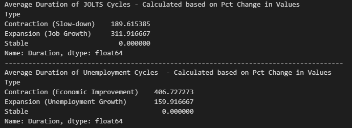
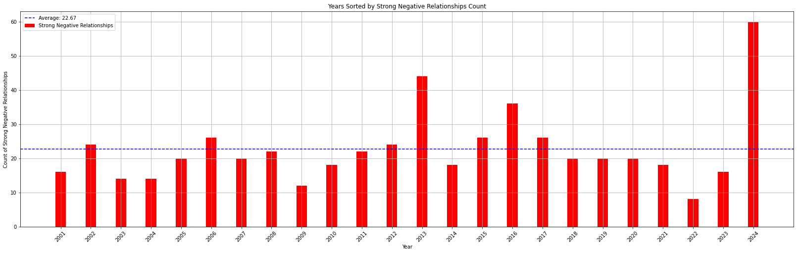
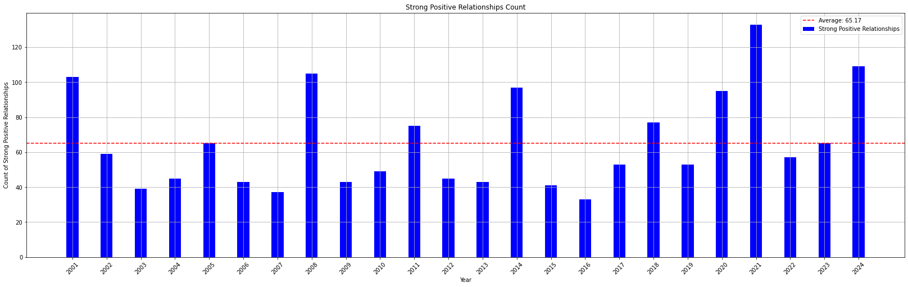
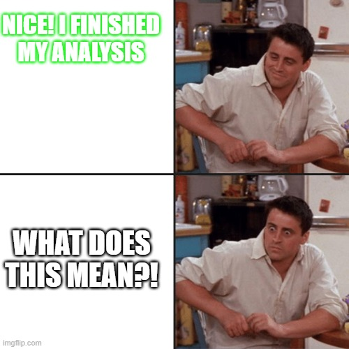

# SPY500 and Job Openings Across All Sectors Analysis
## $${\color{red}Why \ does \ 2024 \ look \ like \ that\ ? \ Are \ we \ being \ lobstered?}$$

## Project Overview
> This project analyzes the relationship between the SPY 500 Index, job openings across various sectors (JOLTS data), and unemployment trends. The aim is to uncover insights into how Job openings and employment trends impact stock market performance and vice versa, especially during different economic cycles. Furthermore, there is an aim to conduct changes in correlations between sectors and changes in their relationship throughout time. 

## Data Sources

>- **JOLTS Data (Job Openings and Labor Turnover Survey):** This data provides insights into job openings across various sectors.
>- **SPY 500 Index:** Used to measure the overall market performance.
>- **Unemployment Data:** Captures unemployment trends across the U.S.

## Tools and Libraries Used

>- Python 3.x
>- **Pandas:** For data manipulation and preprocessing.
>- **NumPy:** For numerical computations.
>- **Matplotlib / Plotly:** For data visualization and trend analysis.
>- **SciPy:** For advanced statistical analysis.
>- **sklearn:** For correlation and regression analysis.

## Steps: 
### **A. Data Preparation:**
- **Merging Datasets:** Combined JOLTS data, SPY 500 index data, and unemployment data.
- **Data Cleaning:** Date formats, round the values for consistency, and ensure the start date (2001-01-01) is the same across files.

### **B. Series of Analysis & Visualizations:**
  #### **1. Correlation Matrix of all JOLTs Sectors + Overall JOLTs + Unemployment Data:**
  - At a glance, it appears that there are many strong relationships across the sectors. 
  - The negative correlation of (-0.524) between total job openings (JTSJOL_TOTAL) and unemployment indicates that as job openings increase, unemployment tends to decrease, and vice versa.
  - Similarly, the sectors shown, such as Leisure and Hospitality (-0.546) and Professional and Business Services (-0.495), exhibit strong negative correlations with unemployment, suggesting that increases in job openings in these sectors are associated with decreases in overall unemployment. This may be due to the large number of employees in this field.
  #### **2. Annual Correlation of all JOLTs Sectors + Overall JOLTS + Unemployment Data:**
  - Since the initial correlation analysis looked at the overall data that included all sectors, it did not tell the entire story. As we know, the labor market has changed over time. Therefore, I wanted to understand how the relationships between U.S. Job Openings across sectors, and unemployed data may potentially influence each other.
  - A Correlation by sector across the  years was performed. A table was created to look at each sector (Sector 1) and its relationship to other sectors (Sector 2). Then a correlation matrix was created for each sector which displayed how the relationships have changed over time.
    
**Here is an Example:**

  #### **3. Analysis of Volatility U.S. Job Openings Percentage Changes with 1-Standard Deviation Bands:**
  - A Standard Deviation Analysis was conducted to highlight periods with significant deviation from the mean. The purpose was to observe when the volatility has diverged from the normal trend.
  - As you can see, there are periods when the Standard Deviation bands expand due to significant changes in previous months which then widen the bands which can reflect expansion after a period of contraction. For example, after economic periods such as  2001, 2008, and 2020.
    

    
  #### **4. Analysis of Volatility U.S. Unemployment Percentage Changes with 1-Standard Deviation Bands:**
  - The unemployment data shows relative stableness compared to the JOLTS overall values. Compared to the JOLTS, the unemployment data has narrow bands compared to the majority of the time.
  - Around 2020, there is a sharp spike in unemployment changes, which deviates significantly beyond 1 standard deviation from the mean. This spike represents the economic impact of the COVID-19 pandemic, which caused a sudden increase in unemployment rates across multiple sectors.

**Summary Std Analysis:**
> - When there are large, sudden deviations (2001,2008,2020), the calculation of the standard deviation reflects this increased variability, making the bands wider in subsequent months.
> - As you can see, the volatility increases during or after recession periods. 
> - Lastly, when looking at the JOLTs and unemployment data, you can see more variability in the Job Openings compared to the unemployment data. I believe this could be due to businesses prioritizing margins instead of growth and expansion during that period. Therefore, businesses stop hiring and focus on surviving with their current workforce. I assume that job openings are impacted first and at a higher rate compared to unemployment which may not be impacted until it is necessary. 

  #### **5. Analysis of Contraction and Expansion Periods in the U.S. Job Openings & Unemployment by measuring Pct Change in values:**
  - After looking at the volatility in the previous analysis, it inspired a few additional analyses in contraction and expansion periods in the U.S. Job Openings and unemployment. 
  - Please note that two analyses were done to assess contraction and expansion periods in slightly different ways. The first was with the std and the other was with the pct change in values. I am only including the one with the pct change in values here to display the trend changes and contraction and expansion period.
>
> ### **Expansion and Contraction Definitions:**
>  **Expansion** is defined as a positive percentage change.
>- For the Job Openings (JTSJOL_TOTAL), it indicates job growth.
>- For the Unemployment data (UNEMPLOYED), it indicates an increase in unemployment, which can be interpreted in specific contexts (e.g., a rising unemployment rate during economic shifts).
>  
>  **Contraction** is defined as a negative percentage change.
>- For the Job Openings (JTSJOL_TOTAL), it signifies a slowdown in job growth.
>- For the unemployment data (UNEMPLOYED), represents a decrease in unemployment, indicating economic improvement.
>

## $${\color{red}Why \ does \ 2024 \ look \ like \ that\ ? \ Are \ we \ being \ lobstered?}$$

  > #### **Summary of Cycles:**
> - JOLTS contractions (slow-downs) last around 190 days, while expansions (job growth) are considerably longer, averaging 312 days, indicating that job growth periods are more sustained than slow-downs.
> - For unemployment, contractions (economic improvement) last significantly longer, around 407 days, compared to expansions (unemployment growth), which average about 160 days. 
> - This suggests that economic recovery in terms of unemployment takes much longer than periods of rising unemployment, while job growth tends to be more prolonged than slow-downs in job openings.
> ##### **Note: Please note that contractions and expansion have different definitions when looking at the JOLTS vs. Unemployment. For example, expansion in the job opening is great, whereas expansion in the unemployment data is not.** 
>>

  #### **6. Correlation Heatmap for each Year:**
- After looking at the cycle changes, I was curious to understand the correlations for each year. Compared to the previous correlation analysis conducted on Analysis A, this heatmap is conducted for each year instead of for each sector throughout the years.
- I noticed that a few years had stronger relationships than others and the years with strong relationships were the years with economic uncertainties. Therefore, I decided to graph it.

- After generating the images, I noticed a similarity in a few years. Therefore, I decided to conduct a clustering analysis to segment the years.

  #### **7. K-means Clustering Analysis based on the strong correlation relationship between sectors for that specific year:**
- Cluster analysis #1: The first analysis was done with the strong correlations for each year.
> Cluster 1: Years [2001, 2008, 2014, 2020, 2021, 2024]
> 
> Cluster 2: Years [2002, 2005, 2011, 2018, 2022, 2023]
> 
> Cluster 0: Years [2003, 2004, 2006, 2007, 2009, 2010, 2012, 2013, 2015, 2016, 2017, 2019]

- Cluster analysis #2: The second analysis was done with more features such as average correlation value and std for the year.
> Cluster 0: Years [2001, 2005, 2008, 2009, 2011, 2014, 2017, 2018, 2020, 2021, 2023]
> 
> Cluster 1: Years [2002, 2003, 2004, 2006, 2007, 2010, 2012, 2013, 2015, 2016, 2019, 2022]
> 
> Cluster 2: Years [2024]

