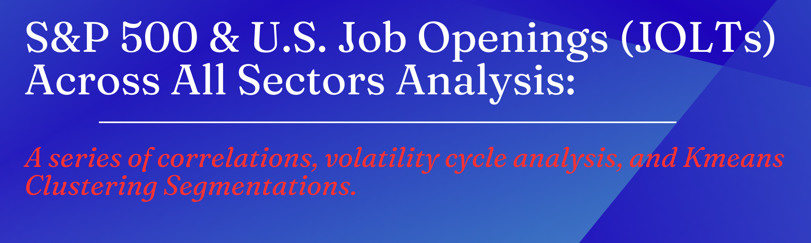

## $${\color{red}Why \ does \ 2024 \ look \ like \ that\ ? \ Are \ we \ being \ lobstered?}$$

## Project Overview
> This project analyzes the relationship between the SPY 500 Index, job openings across various sectors (JOLTS data), and unemployment trends. The aim is to uncover insights into how Job openings and employment trends impact stock market performance and vice versa, especially during different economic cycles. Furthermore, the objective is to conduct changes in correlations between sectors and changes in their relationship over time.

## Data Sources
Analysis was conducted on Sept 2024 and all files were as of July 2024. 
>- **JOLTS Data (Job Openings and Labor Turnover Survey):** This data provides insights into job openings across various sectors.
>- **SPY 500 Index:** Used to measure the overall market performance.
>- **Unemployment Data:** Captures unemployment trends across the U.S. 

## Tools and Libraries Used

>- Python 3.x
>- **Pandas:** For data manipulation and preprocessing.
>- **NumPy:** For numerical computations.
>- **Matplotlib / Plotly:** For data visualization and trend analysis.
>- **SciPy:** For advanced statistical analysis.
>- **sklearn:** For correlation and regression analysis.

## Steps: 
### **A. Data Preparation:**
- **Merging Datasets:** Combined JOLTS data, SPY 500 index data, and unemployment data.
- **Data Cleaning:** Date formats, round the values for consistency, and ensure the start date (2001-01-01) is the same across files.

### **B. Series of Analysis & Visualizations:**
#### **1. Correlation Matrix of all JOLTs Sectors + Overall JOLTs + Unemployment Data:**
**Overview of Job Openings and Unemployment Relationships**
- Strong Sector Relationships: Initial observations indicate robust relationships across various sectors.
- Negative Correlation: A notable negative correlation of -0.524 between total job openings (JTSJOL_TOTAL) and unemployment suggests that as job openings increase, unemployment tends to decrease, and vice versa.

**Sector-Specific Insights**
- Sectors such as Leisure and Hospitality (-0.546) and Professional and Business Services (-0.495) also show strong negative correlations with unemployment.
- These trends imply that increases in job openings within these sectors are linked to reductions in overall unemployment, likely due to the significant number of employees in these fields.

#### **2. Annual Correlation of all JOLTs Sectors + Overall JOLTS + Unemployment Data:**
**Analyzing Correlations Over Time**
- Limitations of Initial Analysis: The initial correlation analysis encompassed overall data across all sectors, which did not fully capture the evolving dynamics of the labor market.
- 
**Detailed Sector Correlation**
- A correlation analysis by sector was conducted to understand the interactions between U.S. job openings and unemployment data over time.
- A table was created to examine relationships between individual sectors (Sector 1) and other sectors (Sector 2), followed by the development of a correlation matrix to display how these relationships have changed over time.
    
**Here is an Example:**

  #### **3. Analysis of Volatility U.S. Job Openings Percentage Changes with 1-Standard Deviation Bands:**
**Standard Deviation Analysis**
Identifying Volatility: A Standard Deviation Analysis was performed to highlight periods of significant deviation from the mean, aiming to observe when volatility diverges from normal trends.

**Expansion After Contraction**
The analysis revealed periods where the Standard Deviation bands expanded due to substantial changes in previous months, indicating potential economic expansion following contraction phases (e.g., 2001, 2008, 2020).
    

    
  #### **4. Analysis of Volatility U.S. Unemployment Percentage Changes with 1-Standard Deviation Bands:**
**Unemployment Data Stability**
Comparison with JOLTS: Unemployment data exhibits relative stability compared to the overall Job Openings and Labor Turnover Survey (JOLTS) values, characterized by narrower bands throughout most periods.

**COVID-19 Impact**
- Around 2020, a sharp spike in unemployment changes deviated significantly beyond one standard deviation from the mean, reflecting the economic impact of the COVID-19 pandemic and the subsequent surge in unemployment rates across multiple sectors.

**Summary Std Analysis:**
> - When there are large, sudden deviations (2001,2008,2020), the calculation of the standard deviation reflects this increased variability, making the bands wider in subsequent months.
> - As you can see, the volatility increases during or after recession periods. 
> Job Openings vs. Unemployment:
A comparison of JOLTS and unemployment data reveals greater variability in job openings than in unemployment figures.
This may be attributed to businesses prioritizing operational efficiency over growth during downturns, leading to reduced hiring while maintaining current workforce levels. Job openings are likely affected more rapidly than unemployment rates, which may only rise when absolutely necessary.

  #### **5. Analysis of Contraction and Expansion Periods in the U.S. Job Openings & Unemployment by measuring Pct Change in values:**
- Inspired by Previous Findings: Insights from the volatility analysis prompted further investigations into contraction and expansion periods in U.S. job openings and unemployment.

**Methodological Distinction:** Please note, that two analyses were conducted to evaluate contraction and expansion periods from different perspectives: one using standard deviation and the other focusing on percentage changes. Here, only the percentage change analysis is presented to illustrate trend shifts during these periods.
>
> ### **Expansion and Contraction Definitions:**
>  **Expansion** is defined as a positive percentage change.
>- For the Job Openings (JTSJOL_TOTAL), it indicates job growth.
>- For the Unemployment data (UNEMPLOYED), it indicates an increase in unemployment, which can be interpreted in specific contexts (e.g., a rising unemployment rate during economic shifts).
>  
>  **Contraction** is defined as a negative percentage change.
>- For the Job Openings (JTSJOL_TOTAL), it signifies a slowdown in job growth.
>- For the unemployment data (UNEMPLOYED), represents a decrease in unemployment, indicating economic improvement.
>

## $${\color{red}Why \ does \ 2024 \ look \ like \ that\ ? \ Are \ we \ being \ lobstered?}$$

  > #### **Summary of Cycles:**
> - JOLTS contractions (slow-downs) last around 190 days, while expansions (job growth) are considerably longer, averaging 312 days, indicating that job growth periods are more sustained than slow-downs.
> - For unemployment, contractions (economic improvement) last significantly longer, around 407 days, compared to expansions (unemployment growth), which average about 160 days. 
> - This suggests that economic recovery in terms of unemployment takes much longer than periods of rising unemployment, while job growth tends to be more prolonged than slow-downs in job openings.
> ##### **Note: Please note that contractions and expansion have different definitions when looking at the JOLTS vs. Unemployment. For example, expansion in the job opening is great, whereas expansion in the unemployment data is not.** 
>>

  #### **6. Yearly Correlation Heatmap Insights:**
- Yearly Correlation Exploration: Building on the previous analyses, I aimed to understand the correlations for each year. Unlike the prior correlation analysis, which examined sector relationships over time, this heatmap focuses on yearly correlations.
- Economic Uncertainty Correlation: Certain years exhibited stronger relationships, particularly during periods of economic uncertainty. Consequently, I chose to graph these findings for better visualization.

- **After generating the images, I noticed similarities across certain years. Therefore, I decided to conduct a clustering analysis to segment the years.**

#### **7. K-means Clustering Analysis based on the strong correlation relationship between sectors for that specific year:**
- Cluster analysis #1: The first analysis was done with the strong correlations for each year.
**Cluster 1: Years [2001, 2008, 2014, 2020, 2021, 2024]**
  - High correlation years, indicating strong inter-sector relationships during economic uncertainty or recovery.
**Cluster 2: Years [2002, 2005, 2011, 2018, 2022, 2023]**
- Moderate correlation years with more stable relationships.
  
**Cluster 0: Years [2003, 2004, 2006, 2007, 2009, 2010, 2012, 2013, 2015, 2016, 2017, 2019]**
- Years with weak relationships, suggesting disconnection among sectors.
  
- Cluster analysis #2: The second analysis was done with more features such as average correlation value and std for the year.
**Cluster 0: Years [2001, 2005, 2008, 2009, 2011, 2014, 2017, 2018, 2020, 2021, 2023]**
**Cluster 1: Years [2002, 2003, 2004, 2006, 2007, 2010, 2012, 2013, 2015, 2016, 2019, 2022]**
**Cluster 2: Years [2024]**
- In the second analysis, 2001, 2008, 2020, and 2021 were all still segmented in the same cluster. However, 2024 was placed separately. I wonder if this is due to the significant change in std which was a new feature in the model. 

